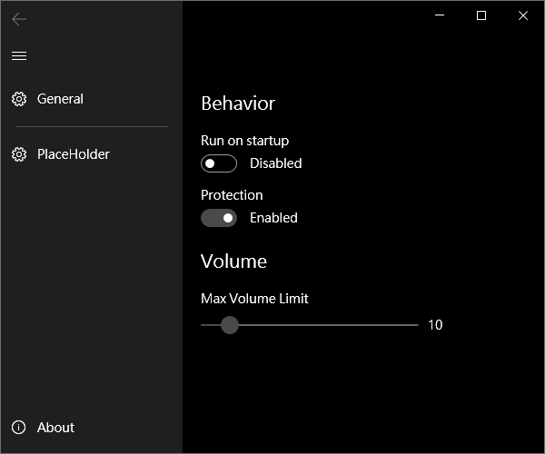

English | [繁體中文](README.zh-TW.md)

<div align="center">
  


<h1>Too Loud</h1>
<h4>
A Windows app that limits your max volume
</h4>


<p align="center">
  <a href="#Preview">Preview</a> •
  <a href="#features">Features</a> •
  <a href="#installation">Installation</a> •
  <a href="#run-locally">Run Locally</a> •
  <a href="#build">Build</a> •
  <a href="#contributing">Contributing</a> •
  <a href="#license">License</a>
</p>
</div>

## Preview


## Features

- Prevent accidentally turning up the volume on Windows
- Maintains volume limits even when the audio output device changes

### Background

This project was inspired by an issue with the Logitech K580 keyboard. When adjusting the volume using its keys, the keyboard frequently causes the volume to repeat uncontrollably, spiking to extreme levels. This was particularly problematic when wearing headphones, as my usual volume range is between 4 and 12 — a sudden jump could be damaging.

Attempts to resolve this issue through Logitech's support were unsuccessful, leading me to create this solution.

**🖕 FUCK LOGITECH**

## Installation

1. Download from [Release](https://github.com/MrNegativeTW/TooLoud/releases) page
2. Place to whatever place you like (expect for trach can)
3. Open `TooLoud.exe`

## Run Locally

Clone the project

1. Install Visual Studio 2022
2. Open .sln file.

## Build

1. Right click on project `TooLoud` (NOT `TooLoud.Package`)
2. Select "Publish", then hit "Publish" again on the right side

These are the default settings:

```
Configuration: Release | Any CPU
Target framework: net9.0-windows10.0.19041.0
Deployment mode: Framework-dependent
Target runtime: win-x64

File publish options
  - Produce single file (optional)
```

3. Go to `bin\Release\net9.0-windows10.0.19041.0\publish\win-x64\`

## Contributing

Contributions are always welcome!

See `contributing.md` for ways to get started.

Please adhere to this project's `code of conduct`.

## Special Thanks

### Code

Inspired by 

- [troylar/quiet-on-the-set](https://github.com/troylar/quiet-on-the-set)
- [ModernFlyouts-Community/ModernFlyouts](https://github.com/ModernFlyouts-Community/ModernFlyouts)

### Images


[Perfection icons created by Freepik - Flaticon](https://www.flaticon.com/free-icons/perfection)

## License

```
idk
```
